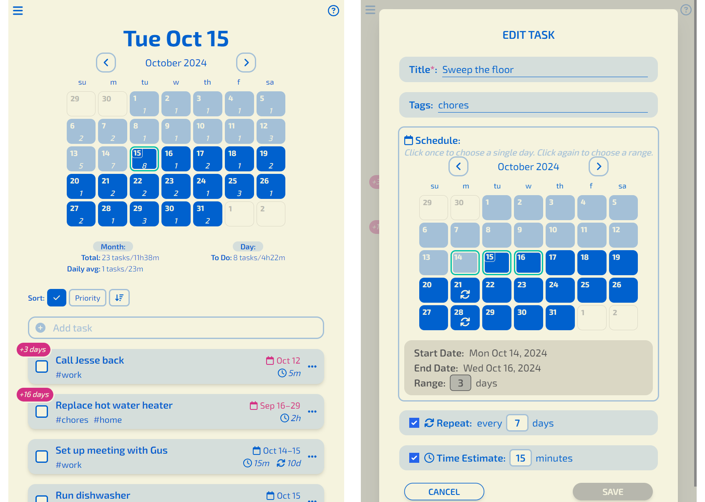

# LyfeSchedule

_the todo app for people that get things done eventually™_



## Key Features

📆 **Task Scheduling**: Easily schedule tasks for today, tomorrow, or a year from now.

🔜 **Date Ranges**: Many tasks don't have a single, strict "due date" - give a task a date range and its priority will scale accordingly.

🔁 **Repeating Tasks**: Set up tasks to repeat every day, week, month, year, or somewhere in between.

⏱️ **Time Estimates**: Estimate how long your tasks will take so you can plan around them.

Be sure to read the [user-facing documentation](https://docs.lyfeschedule.com/) for more info.

This app can be run locally on any machine that supports Node and MongoDB, or it can be deployed remotely "on the cloud". If you just want to try it out, there is an invite-only instance running for beta testing purposes. Send us [an email](mailto:beta@lyfeschedule.com?subject=Request%20for%20beta%20access) to request access.

## Tech Stack

This is a [Next.js](https://nextjs.org/) project bootstrapped with [`create-next-app`](https://github.com/vercel/next.js/tree/canary/packages/create-next-app).

- TypeScript (statically-typed JavaScript)
- React 18 (front-end framework)
- Tailwind CSS (style framework)
- Node.js and Express.js (web & dev server framework)
- MongoDB (data store)
- Webpack (build and bundling tools)
- Nodemailer, MJML, and Handlebars (email templating & sending)
- NextAuth.js (user authentication)
- Jest (automated testing)

## Run the App

### Installation

You'll need the following dependencies:

1. Node.js, at least v18.16.0
1. npm, yarn, or pnpm
1. MongoDB connection string - either a local installation, or a remote instance, like on MongoDB Atlas for example.
   1. Create a database, recommended name `LyfeSchedule-beta`
1. For account management (e.g. sending invites, resetting passwords), you will need a SMTP email service
1. A local clone of this repo

Finally, install Node dependencies:

```bash
# from inside the project directory
npm install
# or
yarn install
# or
pnpm install
```

### Environment

See the [`.env.example`](./.env.example) for info on required and optional environment variables. Either create a `.env.local` file at the project root or define the variables another way.

### Run the server

TODO production server steps

First, run the development server:

```bash
npm run dev
# or
yarn dev
# or
pnpm dev
```

Open [http://localhost:3000](http://localhost:3000) with your browser to see the result. Pages will auto-update as you edit and save the files.

## Development

TODO contribution guide

To learn more about Next.js, take a look at the following resources:

- [Next.js Documentation](https://nextjs.org/docs) - learn about Next.js features and API.
- [Learn Next.js](https://nextjs.org/learn) - an interactive Next.js tutorial.

You can check out [the Next.js GitHub repository](https://github.com/vercel/next.js/) - your feedback and contributions are welcome!

### Installation and Environment

Same as the [Installation](#installation) and [Environment](#environment) sections above.

### Run the dev server

First, run the development server:

```bash
npm run dev
# or
yarn dev
# or
pnpm dev
```

Open [http://localhost:3000](http://localhost:3000) with your browser to see the result. Pages will auto-update as you edit and save the files.

### Testing

This project uses Jest for automated testing. Run the tests:

```bash
npm test
# or
npm run test:watch
```

### Suggested tools

- VS Code (TODO extensions?)
- ESLint
- MongoDB Compass
- Postman

## Feedback

Please let us know if you find a bug or have thoughts on what could be improved by sending an email to [feedback@lyfeschedule.com](mailto:feedback@lyfeschedule.com?subject=Feedback%20on%20LyfeSchedule).

## License

TODO, I haven't decided yet 😉
